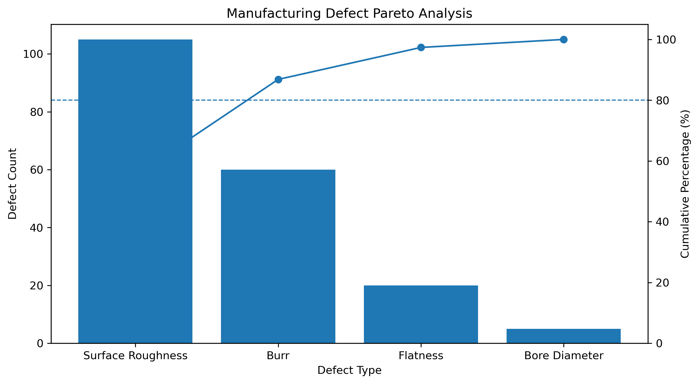
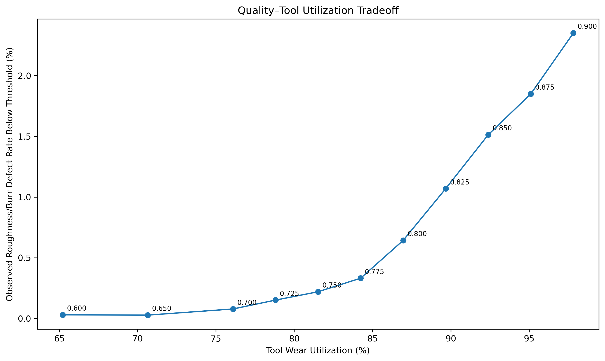

# CNC Manufacturing Quality Improvement

A data-driven manufacturing quality improvement project applying the DMAIC methodology to a simulated CNC machining process.

The project analyzes production and quality data to evaluate process performance, identify the dominant defect modes, assess statistical process stability, investigate root causes, and evaluate process improvements.

The analysis focuses on four critical-to-quality (CTQ) characteristics:

- Surface Roughness
- Burr Height
- Flatness
- Bore Diameter

Methods used include Pareto analysis, Statistical Process Control (SPC), regression modeling, ANOVA, interaction analysis, root cause analysis, sensitivity analysis, and Process Failure Mode and Effects Analysis (PFMEA).

## Project Objective

The objective of this project was to identify the primary sources of quality variation in a simulated CNC machining process and develop data-supported improvement actions.

The analysis followed the DMAIC framework to:

- Establish baseline manufacturing and quality performance.
- Identify the defect categories contributing most to overall quality losses.
- Evaluate statistical stability of the CTQ characteristics using SPC.
- Determine the process, machine, material, and operating factors associated with each CTQ.
- Translate root-cause findings into improvement actions through sensitivity analysis and PFMEA.

## Dataset & Manufacturing Process

The simulated dataset represents a CNC machining operation using five CNC machines and includes part-level production, process, material, operator, and quality measurements.

Key variables include:

- Machine, operator, shift, and material lot
- Tool wear and machine deterioration
- Feed rate and other machining conditions
- Material hardness and machinability effects
- Cycle time, downtime, rework, and scrap
- Surface Roughness, Burr Height, Flatness, and Bore Diameter measurements

These variables allowed the process to be evaluated from both manufacturing-performance and product-quality perspectives.

## DMAIC Methodology

The project was structured using the DMAIC framework:

**Define** — Established the manufacturing quality problem and identified the critical-to-quality characteristics.

**Measure** — Evaluated production performance, defect rates, cycle time, OEE, downtime, and reliability.

**Analyze** — Used Pareto analysis and SPC to identify priority defect modes and process instability, followed by separate root cause analyses for Surface Roughness, Burr Height, Flatness, and Bore Diameter.

**Improve** — Performed sensitivity analysis to evaluate controllable process changes, including preventive tool-replacement thresholds and feed-rate operating conditions.

**Control** — Used PFMEA to document failure modes, causes, existing controls, and recommended actions for sustaining process improvements.

## Key Findings

### Defect Prioritization

Pareto analysis was used to determine which quality issues contributed most to overall defects. Surface Roughness and Burr Height emerged as the primary defect categories and became the main focus of the subsequent improvement analysis.



### Statistical Process Control

Individuals and Moving Range (I-MR) charts were developed for each CTQ across the five CNC machines.

The SPC analysis showed that Surface Roughness, Burr Height, Flatness, and Bore Diameter were not statistically stable. Because process stability was not established, process capability indices were not used as the basis for evaluating process performance.

The instability observed through SPC provided the basis for proceeding to root cause analysis rather than treating the observed variation as common-cause variation from a stable process.

### Root Cause Analysis

Separate root cause analyses were conducted for each CTQ because the drivers of variation differed across the four quality characteristics.

**Surface Roughness**
- Tool wear was the dominant driver of Surface Roughness variation.
- Material machinability also contributed to Roughness variation.
- Machine and operator effects were evaluated alongside measured process conditions.

**Burr Height**
- Tool wear was the strongest practical driver of Burr Height.
- Feed rate and material hardness also had statistically significant effects.
- Feed rate had a smaller practical effect than tool wear.

**Flatness**
- Machine, operator, material lot, shift, production sequence, and measured process variables were investigated.
- The available production-observable variables did not provide a strong explanation for the observed Flatness variation.
- This indicated that additional unmeasured process factors may need to be investigated.

**Bore Diameter**
- Bore variation differed across machines.
- Tool wear effects were machine-dependent.
- Machine × Material Lot interactions explained substantial additional variation, indicating that material conditions affected machines differently.

### Improve Phase — Sensitivity Analysis

Sensitivity analysis translated the root cause findings into potential process improvements, with primary emphasis on Surface Roughness and Burr Height.

Five questions were evaluated:

1. How sensitive are Surface Roughness and Burr Height to increasing tool wear?
2. What preventive tool-replacement threshold provides a reasonable balance between quality risk and tool utilization?
3. How does feed rate affect Burr Height after controlling for tool wear and material hardness?
4. Does feed rate become more influential as tool wear increases?
5. Do material conditions change the safe operating region?

The analysis showed that both Surface Roughness and Burr Height deteriorated progressively with tool wear, with defect risk increasing sharply at higher wear levels.

A preventive tool-replacement window of **0.70–0.75 wear** was identified as a practical operating range. This range retains approximately **76–82% of the observed tool-wear range** while keeping observed Roughness and Burr defect risk low.



Feed rate was also associated with Burr Height after controlling for tool wear and material hardness, but its practical effect was substantially smaller than the effect of tool wear. No meaningful Tool Wear × Feed Rate interaction was identified.

Material conditions influenced quality response, particularly the relationship between machinability and Surface Roughness, but did not provide strong practical evidence for using different preventive tool-replacement thresholds within the proposed 0.70–0.75 range.

### Recommended Process Improvements

Based on the root cause and sensitivity analyses, the following process improvements were proposed:

- Implement preventive tool replacement within the **0.70–0.75 tool-wear range**.
- Maintain feed rate within a controlled operating window to reduce its contribution to Burr Height variation.
- Monitor tool-wear progression as a primary leading indicator for Surface Roughness and Burr Height deterioration.
- Track material hardness as a secondary Burr Height risk factor.
- Track material machinability as a secondary Surface Roughness risk factor.
- Use vibration and other process signals as early-warning indicators for Surface Roughness deterioration.
- Continue investigating Flatness using additional process variables not captured in the current dataset.
- Monitor machine-specific Bore Diameter behavior because tool-wear and material effects vary across machines.

### Process Failure Mode and Effects Analysis (PFMEA)

A PFMEA was developed to translate the analytical findings into process-risk controls.

The PFMEA links the identified quality failure modes with their potential causes, current controls, and recommended actions. Findings from the root cause and sensitivity analyses were used to support the assessment rather than relying only on qualitative judgment.

The completed PFMEA is available here:

[View PFMEA](documentation/PFMEA.xlsx)

## Tools & Technical Methods

**Programming & Analysis**
- Python
- pandas and NumPy
- statsmodels
- scikit-learn
- Matplotlib

**Manufacturing & Quality Methods**
- DMAIC
- Pareto Analysis
- Statistical Process Control (I-MR Charts)
- Root Cause Analysis
- Multiple Linear Regression
- ANOVA and Partial F-Tests
- Interaction Analysis
- Tukey HSD
- Sensitivity Analysis
- PFMEA
- OEE and manufacturing performance analysis

## Repository Structure

```text
cnc-manufacturing-quality-improvement/
│
├── data/
│   └── manufacturing_quality_improvement_data.csv
│
├── documentation/
│   └── PFMEA.xlsx
│
├── figures/
│   ├── pareto/
│   ├── spc/
│   ├── rca/
│   └── sensitivity_analysis/
│
├── scripts/
│   ├── performance_analysis.py
│   ├── Pareto_analysis.py
│   ├── spc_analysis.py
│   ├── rca/
│   │   ├── bore_diameter_rca.py
│   │   ├── rca_burr.py
│   │   ├── rca_flatness.py
│   │   └── rca_roughness.py
│   └── improve/
│       └── sensitivity_analysis.py
│
└── README.md

## Project Scope

This project was developed using simulated CNC manufacturing data to demonstrate the application of manufacturing engineering, statistical analysis, and continuous improvement methods to a realistic quality-improvement problem.

The recommendations represent data-supported improvement proposals derived from the simulated process and were not implemented on a physical production line.